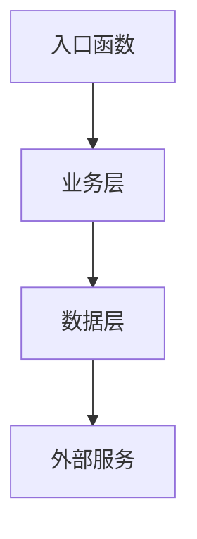

# 项目分析与质量检查指南

## 📋 分析概览
执行顺序：**架构分析 → 代码质量 → 模块关系 → 一致性检查**

---

## 🏗️ 第一阶段：技术架构分析

### 1.1 架构识别
- **设计模式**：识别使用的设计模式（MVC、MVVM、微服务等）
- **架构风格**：分层架构、事件驱动、管道过滤器等
- **技术栈**：前端、后端、数据库、中间件版本清单

### 1.2 项目结构
```
项目根目录/
├── 核心模块清单
├── 配置文件分析  
├── 依赖关系图
└── 部署结构
```

**输出格式**：
- 架构图（Mermaid或ASCII）
- 技术栈表格
- 模块职责矩阵

---

## 🔍 第二阶段：代码质量评估

### 2.1 代码规范（权重：30%）
- **一致性检查**：命名规范、格式化、注释风格
- **复杂度分析**：圈复杂度、函数长度、嵌套深度
- **最佳实践**：SOLID原则遵循度

### 2.2 测试与文档（权重：25%）
- **测试覆盖率**：单元测试、集成测试、E2E测试
- **文档完整性**：API文档、README、代码注释
- **示例代码**：使用指南、快速开始

### 2.3 技术债务（权重：45%）
- **代码坏味道**：重复代码、过长函数、神类
- **性能瓶颈**：慢查询、内存泄漏、N+1问题
- **安全隐患**：输入验证、权限控制、敏感信息

**输出格式**：
```
质量评分：X/100
├── 代码规范：X/30
├── 测试文档：X/25  
└── 技术债务：X/45

优先修复项：
1. [高危] 问题描述 → 修复建议
2. [中危] 问题描述 → 修复建议
```

---

## 🔗 第三阶段：模块关系分析

### 3.1 核心函数识别
按重要性分类：
- **🟥 核心入口**：main函数、路由处理器、API网关
- **🟨 业务逻辑**：核心算法、数据处理、业务规则
- **🟩 工具辅助**：工具函数、配置加载、日志处理

### 3.2 调用链路分析


### 3.3 依赖关系评估
- **耦合度矩阵**：模块间依赖强度（强/中/弱）
- **循环依赖**：识别并标记需要重构的循环引用
- **接口设计**：API一致性、参数合理性、错误处理

**输出格式**：
- 调用关系图（Mermaid）
- 依赖矩阵表格
- 重构建议清单

---

## ⚖️ 第四阶段：一致性检查与协调

### 4.1 关键一致性检查
| 检查维度 | 验证点 | 状态 | 建议 |
|---------|--------|------|------|
| 功能 ↔ 架构 | 需求覆盖度 | ✅/❌ | 具体建议 |
| 体验 ↔ 技术 | 性能可达性 | ✅/❌ | 具体建议 |
| 计划 ↔ 资源 | 工期合理性 | ✅/❌ | 具体建议 |
| 测试 ↔ 质量 | 覆盖充分性 | ✅/❌ | 具体建议 |
| 部署 ↔ 运营 | 可运维性 | ✅/❌ | 具体建议 |

### 4.2 协调优先级
1. **核心商业目标** > 功能完整性
2. **技术可行性** > 理想设计
3. **用户价值** > 开发便利性
4. **系统稳定** > 快速交付

### 4.3 风险评估
```
🔴 高风险：影响核心功能或用户体验
🟡 中风险：影响开发效率或维护成本  
🟢 低风险：优化空间，非必须解决
```

---

## 📊 最终输出模板

### 执行摘要
- **项目概述**：一句话描述项目类型和规模
- **整体评级**：A/B/C/D（优秀/良好/一般/需改进）
- **关键发现**：3-5个最重要的发现
- **行动建议**：按优先级排序的前3项改进措施

### 详细报告
1. **架构健康度**：设计合理性、技术选型适配度
2. **代码质量分**：可读性、可维护性、性能表现
3. **项目成熟度**：开发流程、文档规范、测试体系
4. **风险清单**：技术风险、进度风险、质量风险

### 改进路线图
```
短期（1-2周）：紧急修复项
中期（1-2月）：架构优化项  
长期（3月+）：技术革新项
```

---
